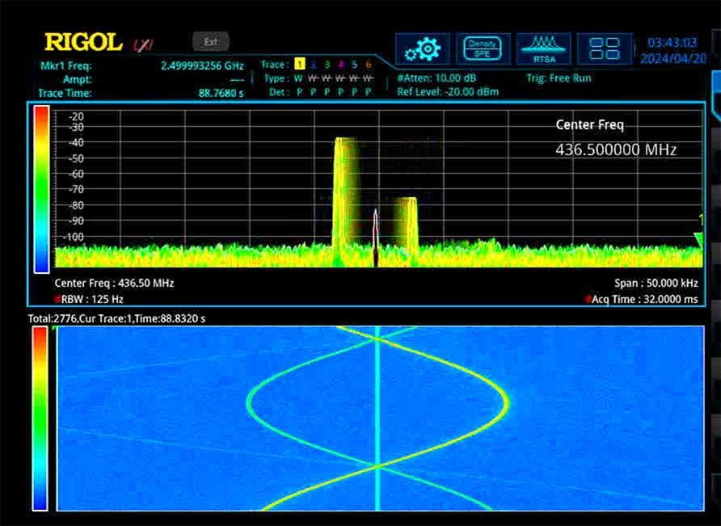

# pluto-tx-fm

Command-line utility for transmitting with frequency modulation using the ADALM PLUTO (Pluto SDR).

The input on stdin is a stream of signed 16-bit little-endian integer samples, proportional to the desired frequency deviation at the sampled instant.

Command line flags:

* `-f <freq>` sets the center frequency in Hz, within the supported range by the Pluto device (with the hack for extended frequency range).

* `-s <samplerate>` sets the sample rate in Hz, used on both the input stream (one integer deviation value per sample) and the output stream (one pair of integers representing I and Q per sample). This program always enables the 8x transmit interpolator in the Pluto, so the valid range of sample rates is 260_417 Hz to 2_083_333 Hz, interface bandwidth permitting.

* `-u <iio context uri>` specifies where to find the Pluto device, using the standard syntax from libiio. The default value is `-u ip:pluto.local`. Use `iio_info -s` to determine your Pluto's URI.

* `-d <deviation>` specifies the desired FM deviation corresponding to the maximum sample value 0x7FFF. This is internally translated to a sensitivity factor. Smaller sample values result in proportionally smaller deviations; negative sample values result in negative deviations. Default 10000 (10 kHz).

* `-a <transmit attenuation>` specifies in dB the amount by which the output power of the Pluto should be reduced from full scale. Analog Devices says this should be at least 10 if the transmitter is looped back to the receiver. Default 10.

* `-b <buffer size>` specifies the size in samples of the IIO kernel buffers. Default computed from samplerate for a 40ms buffer.

* `-x <xtal oscillator correction>` specifies the crystal oscillator correction in Hz. Default 0.

* `-E` enables offset tuning. The local oscillator is set to `freq` - 1.5 * `deviation` and the signal is offset from there to remain centered on `freq`.

* `-q` quiets the status messages printed to stdout

Before the input stream has sent the first TBD samples, the transmitter is off. The transmitter is automatically enabled when samples are buffered. When the input stream underruns by TBD samples, the transmitter shuts off.

Portions of this program are based on the standard IIO demo code from Analog Devices.

## Basic Build and Test

Build the program using `buildtest.sh` and the test signal source using `ssbuild.sh` and feed the test signal source into the program. Like this:

```
./buildtest.sh
./ssbuild.sh
./sweep-sine | ./pluto-tx-fm -f 436500000 -s 273000
```
and observe the Pluto's transmit output on a spectrum analyzer tuned to 436.5 MHz with a span of about 50 kHz. You can try various command line arguments to pluto-tx-fm, but note that sweep-sine is hard-coded to a fixed sample rate of 273000 Hz.



In the spectrum analyzer image above you can see the main signal (brightest line and highest peak), a symmetrical image of the signal (about 40 dB lower), and the local oscillator leakage (near zero frequency offset).
## Troubleshooting

If you get this:
```
Error -22 writing to channel "frequency"
value may not be supported.
```
then you're probably trying to use a frequency that's not officially supported on the Pluto.
See [ADALM-PLUTO SDR Hack](https://www.rtl-sdr.com/adalm-pluto-sdr-hack-tune-70-mhz-to-6-ghz-and-gqrx-install/) for info on how to extend the frequency range covered (probably) by the Pluto, or use an officially supported frequency between 325 MHz and 3800 MHz.